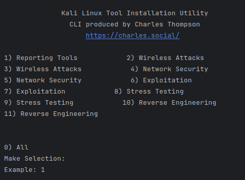

Based on your input, let's refine the repository description and documentation outline for "ksectools," a program designed to install Kali Linux tools on Ubuntu systems. Here's an updated framework:

### Repository Description for ksectools

1. **Project Name:** ksectools

2. **Introduction:**
   - ksectools enables the installation of Kali Linux's specialized tools on Ubuntu systems, bridging the gap between a specialized security platform and a general-use operating system.
   - This integration allows Ubuntu users to access a suite of powerful security tools for purposes like penetration testing, network security analysis, and vulnerability scanning within their familiar environment.

3. **Compatibility Information:**
   - Currently tested on Ubuntu 22 LTS and Ubuntu 23 LTS.
   - Additional compatibility details to be determined (TBD).

4. **List of Kali Linux Tools:** (TBD)
   - A comprehensive and categorized list of Kali Linux tools that ksectools can install.
   - Include tool descriptions and use cases where appropriate.

5. **Security and Legal Disclaimer:** (TBD)
   - Emphasize the legal and ethical use of security tools.
   - Warn about potential risks associated with misuse and advise on best practices for secure and responsible usage.

### Documentation Outline for ksectools

1. **Getting Started:**
   
   

2. **Installation Guide:** (TBD)
   Work in Progress

3. **Usage Guide:**
   

4. **Configuration and Customization:** (TBD)

5. **FAQs and Troubleshooting:** (TBD)

6. **Contributing:**
   report bugs, suggesting features, submitting pull requests

7. **License and Credits:** (TBD)
Charles Thompson

8. **Contact Information:** (TBD)
Email: contact@charles.social

### Additional Considerations